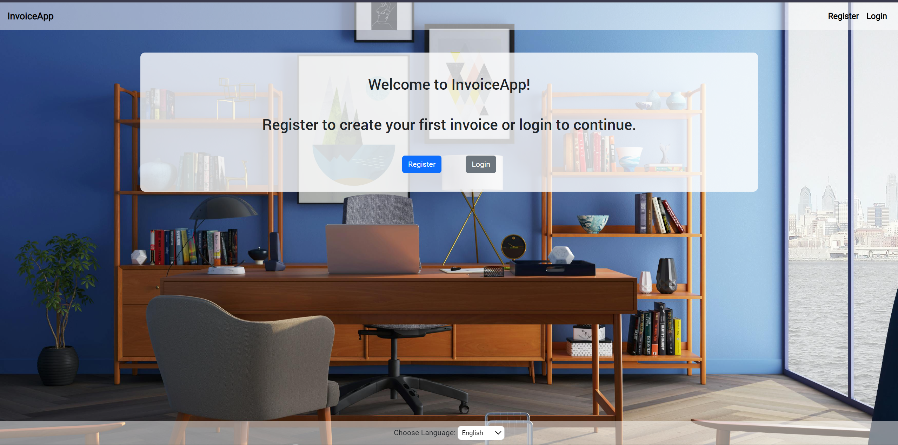

# Invoice-app
Welcome to my MVP project Invoice App. 
This project is suitable for small businesses that want to issue invoices easily and quickly, and have access to them at any time.

# Functionality
### User Features:
1. User registration and login with their company details.
2. Editing company details.
3. Adding a list of bank accounts with easy access for editing and deletion.
4. Adding a client registry.
5. Issuing invoices for added clients.
6. Summary list of invoices with options to view, edit, delete, and download as a PDF file.
7. Creating a report of sold products and quantities, with the option to download as a PDF file.

### Admin Features:
1. Restoring deleted invoices.
2. Assigning new administrators from the user list.
3. Removing administrative rights from users.

# Running the Application
To run the application, you need to set your MySQL username and password as VM options.  
After starting, you will have 3 users:
1. admin@abv.bg with the password "admin";
2. test@abv.bg and test2@abv.bg, both with the password "11111";

# Application pages

